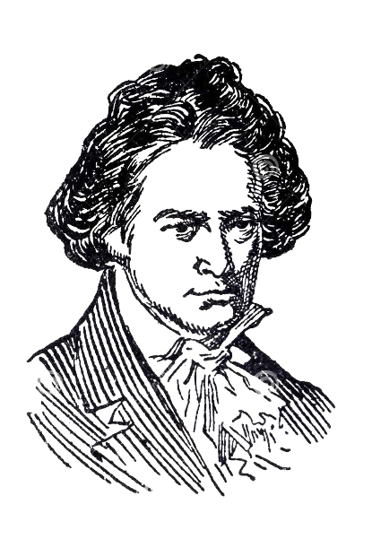

# Bot-hoven: Deep Learning ”Composers” for Classical Music Generation

Bot-hoven is an end-to-end deep learning architecture that generates solo piano music in the style of Ludwig van Beethoven’s works.

## Data

The data directory includes two datasets: full_beethoven includes only the 32 Piano Sonatas (some full midis and some split into movements) and maestro_beethoven includes Beethoven works from the International Piano E-Competition retrieved from Magenta's full MAESTRO dataset. We use full_beethoven to train our model.

## Files & Running the Code

process_data.py splices the MAESTRO dataset into subsets (in this case, we retrieved Beethoven's works along with additional solo piano works of Beethoven not part of the MAESTRO dataset). The data directory includes several datasets on which we serially trained the transformer model.

The transformer-current directory includes code to preprocess, train, and generate music based off the input datasets. Run preprocess_music.py, then train_music.py, and finally generate_music.py to ultimately generate music. The weights at the 200th epoch checkpoint was too large to directly include in the Github repo so we include it in Github storage.

Our transformer is modeled after Huang et al. of Google Brain, David Svy, and Dai et al.'s models.

The LSTM can be run through the included Python notebook, PianoGenLSTM.ipynb.